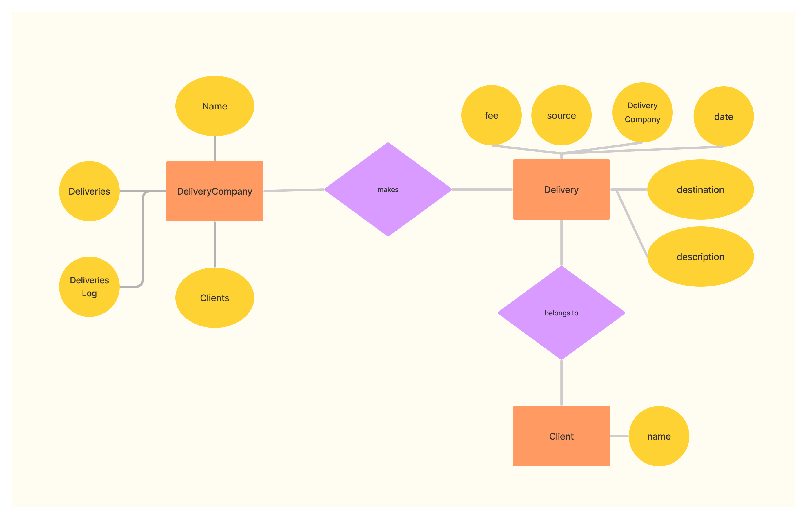

# Description
Code to implement the system described as follows:


> Una compañía Aérea se dedica al negocio de transporte de cargas aéreas entre diferentes orígenes y destinos.
> 
> La compañía solo puede transportar paquetes de Clientes.
> 
> Por cada paquete transportado la compañía aérea cobra 10$
> 
> Debe existir un método que genere un reporte con el total de paquetes transportados y el total recaudado para un día determinado.


## Technical description

### Stack description
In order to implement the hypothetical aerial delivery system, Python 3.10 was used. 

Pytest was used for writing test cases, and Black was used to format the python files according to the PEP 8 standard.

Micromamba was used as the package manager in order to install those packages.

### Workflow Description
#### Deliver a package
In order to deliver a package an instance of DeliveryCompany has to call its method deliver_package with the following arguments: an instantiated Delivery, Client, and two Locations (a source Location and a destination).

By default the delivery is logged as it happened the moment the method was executed, but you can pass a creation_date datetime object to be used instead.

#### Make a report by date
In order to make a report an instance of DeliveryCompany has to call its method report_by_date with a date in the format %Y-%m-%d ("2023-05-24" for example) as an argument. 

The report is saved under the reports directory.

> Example usages can be seen in the test file.




### Example Report
```
/--- Deliveries report for date : 2024-05-25 ---/
Total collected: 20
Total amount of packages delivered: 2
Detailed description
● Delivery with source: Location(name='Cordoba, ARG', lat=-31.4201, long=-64.1888), and destination: Location(name='Buenos Aires, ARG', lat=-34.6037, long=-58.3816).

 Provided description:'sertales'
 Delivered by company: aerolineas argentinas, For client: farmacia Lider.

 Associated delivery fee=10, creation_date=2024-05-25 11:06:53.296906, creation_date_string='2024-05-25')● Delivery with source: Location(name='Cordoba, ARG', lat=-31.4201, long=-64.1888), and destination: Location(name='Buenos Aires, ARG', lat=-34.6037, long=-58.3816).

 Provided description:'actron'
 Delivered by company: aerolineas argentinas, For client: farmacia Lider.

 Associated delivery fee=10, creation_date=2024-05-25 11:06:53.296917, creation_date_string='2024-05-25')
 /---------------/
```


# Dependencies
`pip install pytest`


## Run tests

`pytest test_main.py`

or, to see logs in terminal:

`pytest test_main.py --capture=no`

> In both cases the report created can be seen in reports directory.
